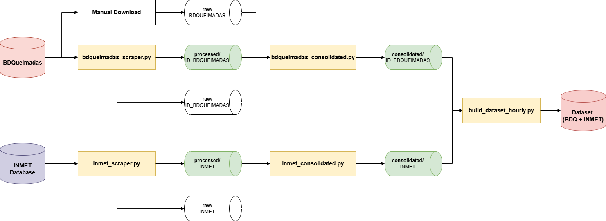
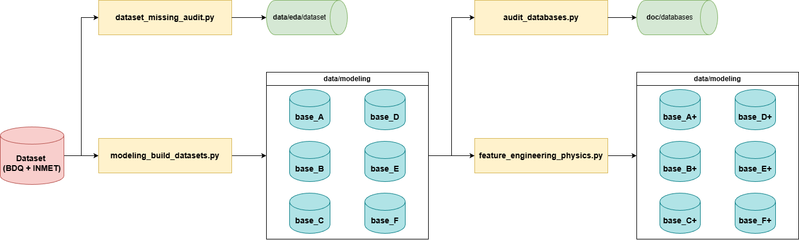
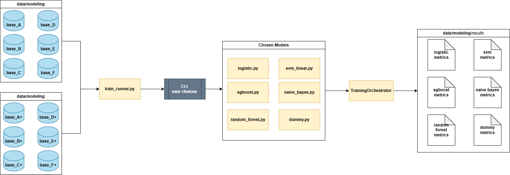
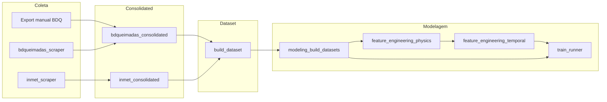

# TCC — Previsão de queimadas (BDQueimadas + INMET)

ETL, fusão horária, bases para modelagem e experimentos de ML para ocorrência de focos (`HAS_FOCO`), com foco no **Cerrado**.  
**Ramo atual:** `article-temporal-fusion` — inclui **fusão temporal** (`tsf_*`) para o artigo (ver [plano 2026-04-07](doc/planos/fusao_temporal_artigo_2026-04-07.md)).

---

## Sumário

* [Hub de documentação](#hub-de-documentação)
* [Diagramas visuais do pipeline (TCC)](#diagramas-visuais-do-pipeline-tcc)
* [Visão geral](#visão-geral)
* [Pipeline em diagrama (Mermaid)](#pipeline-em-diagrama-mermaid)
* [Branch `article-temporal-fusion`](#branch-article-temporal-fusion)
* [Pipeline do artigo (`src/article/`)](#pipeline-do-artigo-srcarticle)
* [Visualização Streamlit do artigo](#visualização-streamlit-do-artigo)
* [Estrutura de pastas](#estrutura-de-pastas)
* [Fluxo do pipeline (ordem sugerida)](#fluxo-do-pipeline-ordem-sugerida)
* [Módulos `src/` (resumo)](#módulos-src-resumo)
* [Pré-requisitos e ambiente](#pré-requisitos-e-ambiente)
* [Configuração](#configuração)
* [Execução rápida](#execução-rápida)
* [Treino (`train_runner`)](#treino-train_runner)
* [Cenários de modelagem (`config.yaml`)](#cenários-de-modelagem-configyaml)
* [Convenções e logs](#convenções-e-logs)
* [Solução de problemas](#solução-de-problemas)

---

## Hub de documentação

| Área | Link |
|------|------|
| **Figuras do pipeline (PNG)** | Pasta [`images/`](images/) — `TCC_dataExtractionPipeline.png`, `TCC_dataAudit_dataProcessing.png`, `TCC_testTrainLogic.png` (ver [diagramas abaixo](#diagramas-visuais-do-pipeline-tcc)) |
| **Espelho técnico de `src/`** (um `.md` por script) | [doc/_src/README.md](doc/_src/README.md) |
| **Plano executado — fusão temporal (diagramas + validação)** | [doc/planos/fusao_temporal_artigo_2026-04-07.md](doc/planos/fusao_temporal_artigo_2026-04-07.md) |
| **Follow-up / próximos passos (2026-04-07)** | [doc/followups/next_steps.md](doc/followups/next_steps.md) |
| **Decisões de engenharia (documento vivo)** | [doc/followups/followup_decisions.md](doc/followups/followup_decisions.md) |
| **Visão geral do projeto (notas)** | [doc/visao_geral/visao_geral_20250928.md](doc/visao_geral/visao_geral_20250928.md) |
| **Bases BDQueimadas (variações A–F, markdown)** | [doc/databases/README_BDQUEIMADAS.md](doc/databases/README_BDQUEIMADAS.md) e arquivos `base_*.md` na mesma pasta |
| **Manuscrito LaTeX (TCC)** | [doc/tcc/main.tex](doc/tcc/main.tex) (capítulos em `doc/tcc/capitulos/`, imagens em `doc/tcc/imagens/`) |
| **Atas / dúvidas** | [doc/atas/](doc/atas/) |
| **Leituras e notas de artigos** | [doc/artigos/mds/](doc/artigos/mds/) |
| **Auditorias em `data/eda/`** | READMEs gerados sob `data/eda/dataset/{ANO}/README_missing.md`; ver também `data/eda/consolidated_audit/` |

---

## Diagramas visuais do pipeline (TCC)

As figuras em [`images/`](images/) acompanham o TCC e este README. Ordem sugerida de leitura: **extração → auditoria/processamento → lógica de treino/teste**.

### 1. Extração e normalização (primeiro passo)

Do dado bruto (portais INMET e BDQueimadas) até consolidações, *join* horário e o **dataset** integrado pronto para EDA e modelagem.



### 2. Auditoria e processamento para modelagem

A partir do **dataset conjunto** (`BDQ + INMET`): em paralelo, **auditoria de faltantes** e construção das **seis bases** A–F; em seguida, **auditoria das bases** (documentação em `doc/databases`) e **engenharia de features físicas** (`feature_engineering_physics.py`), que produz as variantes enriquecidas — no diagrama como **base_A+** … **base_F+**; no repositório correspondem às pastas `*_calculated` sob `data/modeling/`.



**Nota (ramo `article-temporal-fusion`):** depois das bases `*_calculated`, o script `feature_engineering_temporal.py` pode gerar pastas `*_tsfusion` com features `tsf_*` (ver [plano da fusão temporal](doc/planos/fusao_temporal_artigo_2026-04-07.md)). Esse passo é complementar ao diagrama acima.

### 3. Treino e teste — cenário “todas as bases × todos os modelos”

Ilustra o fluxo do **`train_runner.py`** quando o utilizador escolhe **todas** as entradas de `modeling_scenarios` no menu de bases e **todos** os modelos disponíveis: para cada base, o orquestrador percorre modelos e variações (GridSearch, SMOTE, pesos, etc.), com **partição temporal** entre treino e teste e escrita de métricas/modelos por *run*.



Cópias destas imagens também existem em `doc/tcc/imagens/` para compilação do LaTeX do TCC.

---

## Visão geral

* **BDQueimadas:** duas linhas de dados — exportações manuais (com `RiscoFogo`, `FRP`) e arquivos oficiais `focos_br_ref_YYYY.zip` (com `foco_id`, `id_bdq`). O script `bdqueimadas_consolidated.py` reconcilia ambas.
* **INMET:** `inmet_scraper.py` + `inmet_consolidated.py` produzem séries anuais homogêneas; consolidação por bioma alimenta o join horário.
* **Dataset horário:** `build_dataset.py` faz *left join* INMET × alvos BDQ por `cidade_norm`/`municipio_norm` + `ts_hour`, com `HAS_FOCO`.
* **Modelagem:** `modeling_build_datasets.py` gera cenários A–F em Parquet; `feature_engineering_physics.py` adiciona pastas `*_calculated`; `feature_engineering_temporal.py` adiciona `*_tsfusion` e métricas de Camada A.
* **Treino:** `train_runner.py` (menu interativo) e biblioteca de modelos em `src/models/`.

Decisões e justificativas: [followup_decisions.md](doc/followups/followup_decisions.md).

---

## Pipeline em diagrama (Mermaid)

Visão **resumida** em texto; o detalhe por etapa está nas [figuras em `images/`](#diagramas-visuais-do-pipeline-tcc).



---

## Branch `article-temporal-fusion`

Entregas principais:

* Script **`feature_engineering_temporal.py`** (legado D/E/F): features `tsf_*` com **`ewma_lags`** e **`sarimax_exog`** sobre parquets `*_calculated`. Suporta dois layouts de saída:
  * `split` (padrão): uma pasta por método em `data/temporal_fusion/{base}/{método}/` — cenários `tf_*_ewma_lags`, `tf_*_sarimax_exog`, `tf_*_champion` no `config.yaml`.
  * `merged` (legado): ambos os métodos num único parquet em `data/modeling/…_tsfusion/`.
* Métricas de **Camada A** em `data/eda/temporal_fusion/`: `layer_a_summary.csv`, `layer_a_summary_train.csv`, `method_ranking_train.csv` (só anos de treino).
* **`train_runner.py`**: detecta e inclui `tsf_*` automaticamente para cenários `tf_*` (via `_is_temporal_fusion_scenario`).
* **`config.yaml`**: `temporal_fusion_paths` mapeia `tf_*_ewma_lags`, `tf_*_sarimax_exog`, `tf_*_champion` ao subcaminho em `data/temporal_fusion/`.
* **`pyproject.toml`**: fusão temporal legada e artigo: `statsmodels`, `aeon` (MiniRocket no pipeline `src/article/`).
* Bases campeãs e seleção por ranking no fluxo **oficial** do artigo: `src/article/article_orchestrator.py` e `method_ranking_article.csv` (não `build_champion_temporal_bases.py`, removido).

Detalhamento: [doc/planos/fusao_temporal_artigo_2026-04-07.md](doc/planos/fusao_temporal_artigo_2026-04-07.md).

---

## Pipeline do artigo (`src/article/`)

Pipeline dedicado à escrita do artigo, separado do pipeline original do TCC.
Opera sobre os parquets em `data/_article/` (coordenadas + biomassa GEE +
fusão temporal) e usa 3 métodos "elite" para feature engineering temporal,
seguidos de uma **Camada A** de triagem científica (Spearman + Mutual
Information contra `HAS_FOCO`).

Detalhamento completo: [doc/planos/plano_fusao_article_v1.md](doc/planos/plano_fusao_article_v1.md).

Estrutura de dados:

```text
data/_article/
├── 0_datasets_with_coords/         # coords + NDVI/EVI (saída de run_pipeline.py)
│   └── base_E_with_rad_knn_calculated/inmet_bdq_{ANO}_cerrado.parquet
├── 1_datasets_with_fusion/         # gerado pelo orquestrador
│   └── base_E_with_rad_knn_calculated/
│       ├── ewma_lags/              # Etapa 1 — método EWMA+lags
│       ├── sarimax_exog/           # Etapa 1 — método SARIMAX c/ biomassa exog
│       ├── minirocket/             # Etapa 1 — embeddings multicanal
│       └── champion/               # Etapa 3 — originais + TOP K tsf_*
└── results/                        # (futuro) métricas e modelos treinados
```

EDA / ranking de features:

```text
data/eda/temporal_fusion/
├── method_ranking_article.csv       # todas as features tsf_* + scores
└── selected_features_article.json   # TOP K selecionadas
```

### Etapas do pipeline

| Script / módulo | Papel |
|---|---|
| `src/article/run_pipeline.py` | **Pré-requisito**: etapas 0–2 (coords, GEE, EDA) que alimentam `0_datasets_with_coords/`. |
| `src/article/temporal_fusion_article.py` | Etapa 1 — fusão temporal (3 métodos elite). |
| `src/article/feature_selection_article.py` | Etapa 2 — Camada A (Spearman + MI). |
| `src/article/article_orchestrator.py` | CLI unificado que encadeia as 3 etapas. |

### Orquestrador — argumentos

```bash
python src/article/article_orchestrator.py [opções]
```

| Flag | Default | Descrição |
|---|---|---|
| `--scenario {D,E,F,folder}` | `E` | Aceita chave curta, `base_X` ou o folder name completo. |
| `--methods ewma_lags sarimax_exog minirocket` | todos do config | Métodos de fusão a rodar na Etapa 1. |
| `--top-k N` | `50` | Número de features `tsf_*` a reter após Camada A. |
| `--years Y Y Y` | todos | Subset de anos a processar. |
| `--test-years N` | `2` | Últimos N anos são reservados como teste (MiniRocket não fita). |
| `--overwrite` | off | Regrava parquets existentes (fusion + champion). |
| `--skip-fusion` | off | Pula Etapa 1 (assume parquets de fusion já gerados). |
| `--skip-selection` | off | Pula Etapa 2 (assume `selected_features_article.json` existente). |
| `--skip-train` | off | Pula Etapa 3 (não gera a base "champion"). |

### Cenários de uso típicos

**1. Pipeline completo, cenário E (default):**

```bash
python src/article/article_orchestrator.py
```

**2. Rodar apenas no cenário D:**

```bash
python src/article/article_orchestrator.py --scenario D
```

**3. Apenas EWMA+Lags (rápido, útil para validar caminho completo):**

```bash
python src/article/article_orchestrator.py --methods ewma_lags
```

**4. Rodar só em alguns anos (debug):**

```bash
python src/article/article_orchestrator.py --years 2020 2021 2022
```

**5. Pular fusão; usar parquets já gerados para re-rodar só a Camada A:**

```bash
python src/article/article_orchestrator.py --skip-fusion
```

**6. Só gerar ranking de features, sem construir a base champion:**

```bash
python src/article/article_orchestrator.py --skip-fusion --skip-train
```

**7. Forçar regravação completa com outro top-k:**

```bash
python src/article/article_orchestrator.py --overwrite --top-k 30
```

**8. Usar a base consolidada existente direto no train_runner (pulando tudo):**

```bash
python src/article/article_orchestrator.py --skip-fusion --skip-selection --skip-train
# (no-op informacional; útil apenas para auditoria dos logs)
```

### Métodos elite — o que cada um gera

| Método | Saída por parquet | Observação |
|---|---|---|
| `ewma_lags` | ~34 colunas `tsf_ewma_*` e `tsf_lag_*` | Vetorizado, rápido; inclui meteo + biomassa (lags de 168h e 336h). |
| `sarimax_exog` | 2 colunas (`*_pred`, `*_resid`) | Endógena `precip`; exogenas `[temp, umid, rad, NDVI_buffer]`. O `resid` é o sinal de anomalia de seca. |
| `minirocket` | 168 embeddings `tsf_minirocket_f000..f167` | 5 canais (precip + temp + umid + NDVI_buffer + EVI_buffer), janela 168h (1 semana). Pré-condição: sem NaN na janela — cenário E ideal. |

### Logs

Cada execução do orquestrador grava um log dedicado em
`logs/article_run_{YYYYMMDD_HHMMSS}.log`, além do stream de console. Erros
recuperáveis (ex.: SARIMAX falhando para uma cidade) são logados como
`WARNING` (primeiras 25 com stack parcial; demais em `DEBUG`), sem
interromper a execução global.

---

## Visualização Streamlit do artigo

A visualização interativa do artigo está em `src/article/viz/app.py` e lê os
Parquets de `data/_article/0_datasets_with_coords/`, respeitando os cenários
de `article_pipeline.scenarios` no `config.yaml`.

Pré-requisitos:

- Ambiente virtual ativo.
- Dependências instaladas (incluindo `streamlit` e `plotly` via `pyproject.toml`).
- Dados já gerados em `data/_article/0_datasets_with_coords/<cenario>/`.

Execução (raiz do repositório):

```bash
streamlit run src/article/viz/app.py
```

Windows PowerShell (sem depender do PATH):

```powershell
.\.venv\Scripts\streamlit.exe run src/article/viz/app.py
```

Atalho pronto no projeto:

```powershell
.\scripts\run_article_viz.ps1
```

O que você encontra na app:

- Aba **Um ano**: exploração de um único Parquet por ano, com filtros de cidade/variáveis.
- Aba **Vários anos**: concatenação de anos e visão comparativa multi-anual.

Mais detalhes da visualização: `src/article/viz/README.md`.

---

## Estrutura de pastas

Caminhos centrais vêm de **`config.yaml`** (`paths.data.*`). Hoje `paths.data.external` aponta para **`./data/consolidated`** (não `data/external`).

```text
.
├── config.yaml
├── config.py                 # constantes e raiz do projeto (dashboard / paths)
├── pyproject.toml             # dependências Python (fonte principal)
├── requirements.txt          # nota de instalação; dependências em pyproject.toml
├── README.md
├── images/                    # figuras para README / TCC (png permitido no git)
├── doc/                       # documentação, TCC LaTeX, planos, followups, _src
├── data/
│   ├── raw/                   # BDQ manual, INMET zip, ID_BDQUEIMADAS zips
│   ├── processed/             # extrações intermediárias
│   ├── consolidated/          # INMET e BDQ alinhados ao join (via config)
│   │   ├── INMET/inmet_{ANO}_{bioma}.csv
│   │   └── BDQUEIMADAS/bdq_targets_{ANO}_{bioma}.csv
│   ├── dataset/               # inmet_bdq_{ANO}_{bioma}.csv + all_years
│   ├── modeling/              # cenários A–F, calculated (parquet)
│   ├── temporal_fusion/       # fusão temporal por método: {base}/{método}/ e bases campeãs
│   └── eda/                   # auditorias, temporal_fusion/layer_a_*, etc.
├── logs/
└── src/                       # scripts Python (ver doc/_src)
```

---

## Fluxo do pipeline (ordem sugerida)

1. **BDQ zip:** `bdqueimadas_scraper.py` → extrai `focos_br_ref_*.csv`.
2. **BDQ manual:** colocar `exportador_*_ref_YYYY.csv` em `data/raw/BDQUEIMADAS/`.
3. **Consolidação BDQ:** `bdqueimadas_consolidated.py` → `data/consolidated/BDQUEIMADAS/`.
4. **INMET:** `inmet_scraper.py` → `inmet_consolidated.py` (por ano; depois consolidados por bioma conforme seu fluxo).
5. **Dataset horário:** `build_dataset.py --biome cerrado` → `data/dataset/inmet_bdq_*_cerrado.csv`.
6. **Auditoria missing:** `dataset_missing_audit.py` → `data/eda/dataset/{ANO}/`.
7. **Parquets A–F:** `modeling_build_datasets.py`.
8. **Features físicas:** `feature_engineering_physics.py` → pastas `*_calculated`.
9. **Fusão temporal (legado):** `feature_engineering_temporal.py --output-layout split` → `data/temporal_fusion/{base}/{método}/` + `data/eda/temporal_fusion/`.
10. **Treino:** `train_runner.py` (cenários `tf_*_ewma_lags`, `tf_*_sarimax_exog`, `tf_*_champion` no menu).
11. **Pós-processamento:** `run_results_consolidator.py` / `run_results_visualization.py` / `plot_confusion.py`.

---

## Módulos `src/` (resumo)

| Script | Papel |
|--------|--------|
| `utils.py` | Config, paths, logging, normalização de chaves, helpers INMET |
| `bdqueimadas_scraper.py` | Download COIDS `focos_br_ref_YYYY.zip` |
| `bdqueimadas_consolidated.py` | Merge manual × processado BDQ |
| `bdq_build_biome_dict.py` | Auxiliar de dicionário bioma |
| `inmet_scraper.py` | Download zips INMET |
| `inmet_consolidated.py` | CSV anual homogêneo por estação |
| `build_dataset.py` | Join horário INMET × BDQ, `HAS_FOCO` |
| `dataset_missing_audit.py` | Relatórios de missing por ano |
| `modeling_build_datasets.py` | Cenários A–F em Parquet |
| `feature_engineering_physics.py` | Features estilo INPE → `*_calculated` |
| `feature_engineering_temporal.py` | Fusão temporal legada (ewma + sarimax_exog) → `data/temporal_fusion/` |
| `tsf_constants.py` | Constantes COL_* / TSF_FAIL_DETAIL_LOG_CAP (partilhadas com `src/article/`) |
| `train_runner.py` | Orquestrador interativo de experimentos |
| `audit_*`, `explore_risco_fogo.py`, `merge_risco_validation.py` | Auditorias e validações |
| `modeling/results_*.py`, `run_results_*.py`, `plot_confusion.py` | Consolidação e gráficos |
| `ml/core.py` | Split temporal, monitor de memória |
| `models/*.py` | Dummy, Logistic, XGBoost, NB, SVM, RF |

Documentação alinhada ao código: [doc/_src/README.md](doc/_src/README.md).

---

## Pré-requisitos e ambiente

* Python **3.10+** (recomendado 3.11).
* **Obrigatório:** na raiz, com venv ativo, `pip install -e .` (dependências em [`pyproject.toml`](pyproject.toml)).
* **Fusão temporal:** pacotes listados no `pyproject.toml`; se algum método não importar, o script segue com os demais.

### Windows (PowerShell)

```powershell
cd D:\Projetos\TCC
python -m venv .venv
.\.venv\Scripts\Activate.ps1
pip install -upgrade pip
pip install -e .
```

### Linux / macOS

```bash
cd /caminho/TCC
python3 -m venv .venv
source .venv/bin/activate
pip install -upgrade pip
pip install -e .
```

---

## Configuração

[`config.yaml`](config.yaml) define:

* `paths.data.raw`, `processed`, **`external` → `data/consolidated`**, `dataset`, `modeling`
* `modeling_scenarios` (A–F, `*_calculated`, `*_tsfusion`)
* URLs BDQueimadas / INMET, logging, seed

Uso típico no código:

```python
from utils import loadConfig, get_logger, get_path

cfg = loadConfig()
raw = get_path("paths", "data", "raw")
```

---

## Execução rápida

### BDQueimadas (zip COIDS)

```bash
python src/bdqueimadas_scraper.py --years 2019 2020
```

### Consolidação manual × processado (Cerrado)

```bash
python src/bdqueimadas_consolidated.py --years 2019 --biome "Cerrado"
```

### INMET

```bash
python src/inmet_scraper.py
python src/inmet_consolidated.py
```

(Ajuste anos/argumentos conforme implementação atual dos scripts.)

### Dataset horário BDQ + INMET

```bash
python src/build_dataset.py --biome cerrado --years 2004 2005
# ou todos os anos com interseção automática:
python src/build_dataset.py --biome cerrado
```

Saídas: `data/dataset/inmet_bdq_{ANO}_cerrado.csv` e `inmet_bdq_all_years_cerrado.csv`.

### Auditoria de missing

```bash
python src/dataset_missing_audit.py
python src/dataset_missing_audit.py --years 2004 2015
```

### Parquets de modelagem

```bash
python src/modeling_build_datasets.py
python src/modeling_build_datasets.py --years 2004 2015 --overwrite-existing
```

### Features físicas e fusão temporal

```bash
python src/feature_engineering_physics.py
python src/feature_engineering_temporal.py --methods ewma_lags sarimax_exog --years 2018 2019
```

### Treino (interativo)

```bash
python src/train_runner.py
```

---

## Cenários de modelagem (`config.yaml`)

Chaves em `modeling_scenarios` mapeiam **nome lógico → pasta sob `data/modeling/`**, por exemplo:

* `base_F_full_original`, `base_A_no_rad`, … `base_E_with_rad_knn`
* `base_F_calculated`, `base_D_calculated` (pós física)
* `base_F_calculated_tsfusion`, `base_D_calculated_tsfusion` (pós fusão temporal)

O `train_runner` lista todas as chaves ordenadas no menu.

---

## Convenções e logs

* **Join horário:** `cidade_norm` + `ts_hour` (`YYYY-MM-DD HH:00:00`); BDQ colapsado ao foco de maior `FRP` por município-hora.
* **Label:** `HAS_FOCO` (1 se `FOCO_ID` presente após left join).
* **Logs:** `get_logger(..., per_run_file=True)` em vários módulos; saída sob `logs/`.

---

## Solução de problemas

* **PowerShell bloqueia venv:** `Set-ExecutionPolicy -Scope CurrentUser RemoteSigned`
* **Pastas ausentes:** confira `io.create_missing_dirs` e `paths` no `config.yaml`
* **Encoding CSV:** consolidadores tentam múltiplos encodings; registre exceções em [followup_decisions.md](doc/followups/followup_decisions.md)
* **Método temporal indisponível:** instale o pacote correspondente ou rode com `--methods` restrito

---

*Última atualização: 2026-04-17 — limpeza do fusão temporal legado (só `ewma_lags` + `sarimax_exog`), `tsf_constants.py`, remoção de `build_champion_temporal_bases.py`.*
