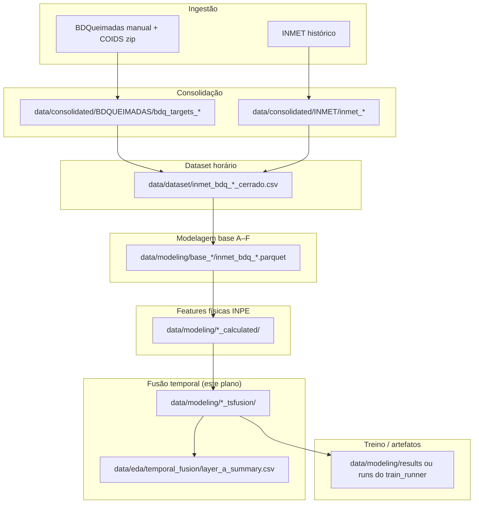
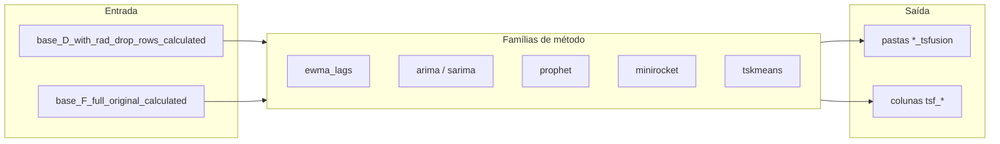
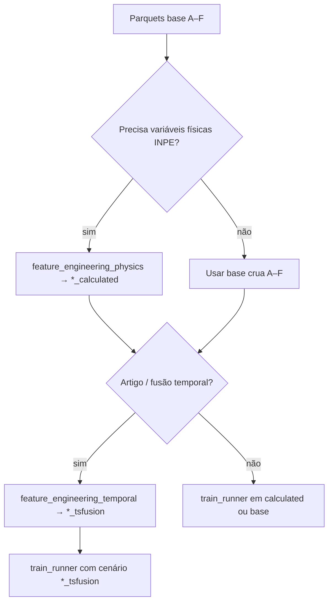

# Plano executado: fusão temporal para o artigo (branch `article-temporal-fusion`)

**Data de registro:** 2026-04-07  
**Commits de referência:** `981e46b` (projeto final), `8bc1c53` (pipeline de feature engineering temporal para artigo)  
**Ramo Git:** `article-temporal-fusion`

---

## 1. Objetivo

Estender o pipeline de modelagem de queimadas (INMET × BDQueimadas, bioma Cerrado) com **camada de fusão temporal** inspirada em arquiteturas de fusão de dados (referência citada no código: Balduino & Valente, *Implementation of IoT Data Fusion Architectures for Precipitation Forecasting*, Preprints 2025). A ideia é gerar features derivadas de séries horárias (`tsf_*`) a partir de bases já enriquecidas com variáveis físicas (*calculated*), e avaliar o impacto em duas camadas:

- **Camada A:** qualidade do ajuste dos modelos temporais na série contínua escolhida (precipitação horária como série `z` principal), via MAE, MSE e R² agregados.
- **Camada B:** impacto na classificação binária `HAS_FOCO` (métricas como PR-AUC no `train_runner`), comparando cenários com e sem `tsfusion`.

---

## 2. Visão de arquitetura (macro)

---

## 3. Fluxo de dados detalhado (fusão temporal)

**Regras implementadas (resumo):**

- Por padrão, enriquece apenas cenários **D** e **F** já na variante `*_calculated` (definidos em `config.yaml` como `base_D_calculated` e `base_F_calculated`).
- Saída em novas pastas: `base_*_calculated_tsfusion` (mapeadas em `config.yaml` como `base_D_calculated_tsfusion` e `base_F_calculated_tsfusion`).
- Janela e refit configuráveis (`--window-hours`, `--refit-hours`); últimos N anos reservados como “teste” para evitar vazamento temporal no ajuste dos modelos de série (`--test-years`).
- Dependências opcionais: `statsmodels`, `prophet`, `aeon` (MiniROCKET), `tslearn` (TimeSeriesKMeans); métodos sem biblioteca disponível são ignorados com aviso.

---

## 4. Artefatos e configuração

| Item | Local / chave |
|------|----------------|
| Cenários de pasta | `config.yaml` → `modeling_scenarios` (inclui `*_calculated` e `*_tsfusion`) |
| Script principal | `src/feature_engineering_temporal.py` |
| Métricas Camada A | `data/eda/temporal_fusion/layer_a_summary.csv` (+ `layer_a_detail.csv` quando houver registros) |
| Orquestração de treino | `src/train_runner.py` (detecta colunas `tsf_*` automaticamente em cenários `tsfusion`) |
| Dependências extras | `requirements.txt` (bloco fusão temporal) |

---

## 5. O que foi entregue nesta branch

1. **Pipeline `feature_engineering_temporal`:** gera parquets enriquecidos com prefixo `tsf_*`, preservando o padrão ano a ano dos parquets de entrada.
2. **Integração com `train_runner`:** cenários cujo nome de pasta contém `tsfusion` estendem o vetor de features com todas as colunas `tsf_*` detectadas no primeiro parquet lido.
3. **`config.yaml`:** chaves `base_D_calculated_tsfusion` e `base_F_calculated_tsfusion` apontando para as pastas de saída.
4. **`requirements.txt`:** pacotes para ARIMA/SARIMA, Prophet, MiniROCKET e TSKMeans.

---

## 6. Próximos passos para validar o plano

Use esta lista como checklist de aceitação científica e de engenharia.

1. **Reprodutibilidade:** rodar `feature_engineering_temporal` com `--methods` restrito (ex.: só `ewma_lags`) num subconjunto de anos (`--years`) e confirmar parquets gerados e contagens de linhas iguais à entrada.
2. **Camada A:** inspecionar `data/eda/temporal_fusion/layer_a_summary.csv`; comparar métodos por ano (MAE/R²); identificar cidades-anos com R² extremo ou `n` muito baixo.
3. **Camada B:** com `train_runner`, treinar o mesmo modelo nas pastas `*_calculated` vs `*_tsfusion` com a mesma variação (ex.: opção 1 Base); registrar PR-AUC / ROC e custo de treino (RAM/tempo).
4. **Ablação de métodos:** repetir (3) removendo famílias (`--methods`) para ver quais `tsf_*` mais contribuem.
5. **Sanidade temporal:** confirmar que `test_size_years` e ordenação por `ts_hour` / `ANO` no treino não violam a hipótese de validação (documentar no TCC se usar splitter temporal).
6. **Dependências:** em ambiente limpo (`venv`), `pip install -r requirements.txt` e smoke test de cada método opcional (import e um ano pequeno).

---

## 7. Diagrama de decisão (escolha de cenário)

---

*Documento mantido em `doc/planos/` e referenciado a partir de `doc/followups/next_steps.md` e do `README.md` raiz.*
