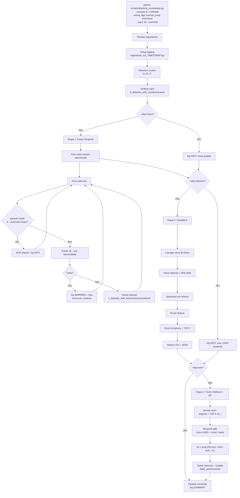

# Plano: Fusao Temporal para o Artigo (v1)

**Data de registro:** 2026-04-16  
**Branch sugerida:** `article-fusion-v1`  
**Documento de referencia:** `doc/_article/dicionario_dados_article.md`

---

## 0. Objetivo

Construir um pipeline dedicado de fusao temporal para o artigo cientifico, separado do pipeline original do TCC, que:

- Le de `data/_article/0_datasets_with_coords/{cenario}/`
- Gera features `tsf_*` com 3 metodos elite (EWMA/Lags, SARIMAX-residuos, MiniRocket multicanal)
- Executa triagem cientifica (Camada A) com Spearman + Mutual Information
- Grava parquets enriquecidos em `data/_article/1_datasets_with_fusion/{cenario}/{metodo}/`
- Expoe tudo via CLI em `src/article/article_orchestrator.py`

Premissa central: **nenhuma coluna original (`*_calculated`) e removida**. As features `tsf_*` sao adicionais e selecionadas por relevancia estatistica.

---

## 1. Arquivos a modificar

### 1.1 `config.yaml`

Adicionar bloco `article_pipeline.temporal_fusion` com:

- `input_root`: `data/_article/0_datasets_with_coords`
- `output_root`: `data/_article/1_datasets_with_fusion`
- `eda_root`: `data/eda/temporal_fusion`
- `results_root`: `data/_article/results`
- `default_scenario`: `E`
- `test_size_years`: `2`
- `top_k`: `50`

Mais sub-blocos para cada metodo (`ewma_lags`, `sarimax_exog`, `minirocket`) com seus parametros.

### 1.2 `src/article/run_pipeline.py`

Opcionalmente registrar as novas etapas (`temporal_fusion`, `feature_selection`) no fluxo existente. **Baixa prioridade** — o orquestrador novo cobre tudo via CLI dedicada.

### 1.3 `README.md`

Adicionar secao `Article Pipeline` documentando os argumentos do orquestrador, com exemplos de cada cenario de uso (rodar tudo, rodar so 1 metodo, pular fusion, pular treino, etc.).

---

## 2. Arquivos novos

### 2.1 `src/article/temporal_fusion_article.py`

Modulo de extracao de features `tsf_*`. Inspirado em `src/feature_engineering_temporal.py` mas:

- **Paths** apontados para `_article/`
- **Slugs ARIMA estendidos**: inclui `ndvi_buffer` e `evi_buffer`
- **Apenas 3 metodos** expostos: `ewma_lags`, `sarimax_exog`, `minirocket`
- **Layout split**: cada metodo em sua propria subpasta (`{cenario}/{metodo}/`)

### 2.2 `src/article/feature_selection_article.py`

Modulo da Camada A. Concatena parquets de treino, calcula Spearman + MI por feature `tsf_*`, normaliza, ordena por score composto, exporta:

- `data/eda/temporal_fusion/method_ranking_article.csv` — ranking completo
- `data/eda/temporal_fusion/selected_features_article.json` — TOP K com metadados

### 2.3 `src/article/article_orchestrator.py`

CLI unificado com argparse, logging por arquivo (`logs/article_run_{timestamp}.log`) e orquestracao das 3 etapas (fusion, selection, train). Cada etapa pode ser pulada via flag.

### 2.4 `doc/planos/plano_fusao_article_v1.md`

Este documento.

---

## 3. Parametros dos 3 metodos elite

### 3.1 EWMA + Lags (rapido, vetorizado)

Variaveis-alvo (slugs):

| Slug | Coluna | Lags (h) | Alphas |
|---|---|---|---|
| `precip` | PRECIPITACAO TOTAL, HORARIO (mm) | 1, 24, 168 | 0.1, 0.3, 0.8 |
| `temp` | TEMPERATURA DO AR - BULBO SECO, HORARIA (°C) | 1, 24, 168 | 0.1, 0.3, 0.8 |
| `umid` | UMIDADE RELATIVA DO AR, HORARIA (%) | 1, 24, 168 | 0.1, 0.3, 0.8 |
| `rad` | RADIACAO GLOBAL (KJ/m²) | 1, 24, 168 | 0.1, 0.3, 0.8 |
| `ndvi_buffer` | NDVI_buffer | 168, 336 | 0.1, 0.3, 0.8 |
| `evi_buffer` | EVI_buffer | 168, 336 | 0.1, 0.3, 0.8 |

Saidas:
- `tsf_ewma_{slug}_a01/a03/a08` (3 colunas por slug = 18 colunas)
- `tsf_lag_{slug}_{lag}h` (3 lags x 4 meteo + 2 lags x 2 biomassa = 16 colunas)

**Total esperado:** ~34 features novas. Custo: muito baixo, vetorizado por `pandas.ewm` e `groupby.shift`.

### 3.2 SARIMAX (Arranjo A — biomassa como exogena)

| Parametro | Valor |
|---|---|
| Endogena | `precip` |
| Exogenas | `[temp, umid, rad, ndvi_buffer]` |
| Ordem ARIMA | `(2, 1, 2)` |
| Ordem sazonal | `(1, 1, 1, 24)` (ciclo diurno) |
| Janela de treino (W) | 720h (30 dias) |
| Refit a cada (H) | 168h (1 semana) |
| Politica exog futura | Ultima linha repetida H vezes |

**Tratamento de falha:** try/except por bloco de cidade/ano. Falhas logadas (primeiras 25 com WARNING completo, 1a com traceback; restante em DEBUG); execucao global continua.

Saidas:
- `tsf_sarimax_exog_precip_pred`
- `tsf_sarimax_exog_precip_resid`

Interpretacao: `resid` negativo grande = deficit de precipitacao alem do que a meteorologia + vegetacao explicam = sinal forte de anomalia de seca.

### 3.3 MiniRocket Multicanal

| Parametro | Valor |
|---|---|
| Canais | `[precip, temp, umid, ndvi_buffer, evi_buffer]` (5 canais) |
| Janela | 168h (1 semana) |
| n_kernels | 168 (dobro do padrao) |
| Fit | Apenas em anos de treino (ANO < ano_corte) |
| Transform | Treino + teste (mesmos kernels) |

**Pre-condicao:** nenhum NaN em nenhum canal na janela. Cenario E (KNN) tem 0% NaN — ideal. Cenarios D/F: janelas com qualquer NaN sao automaticamente skippadas (preds = NaN).

Saidas: `tsf_minirocket_f000` ... `tsf_minirocket_f167` (168 embeddings float32).

---

## 4. Camada A — Feature Selection (logica detalhada)

### 4.1 Objetivo

Garantir que apenas features `tsf_*` com poder discriminativo real contra `HAS_FOCO` cheguem aos classificadores XGBoost/RF. **Nunca remove colunas originais.**

### 4.2 Fluxo

```
Parquets de treino (anos < corte) em 1_datasets_with_fusion/{cenario}/{metodo}/
        |
        v
Concatenar todos os anos de treino
(opcional: amostragem estratificada por HAS_FOCO se RAM insuficiente)
        |
        v
Identificar colunas tsf_* (candidatas) vs HAS_FOCO (alvo)
        |
        v
Filtrar candidatas com > 50% NaN no treino (descartadas com log)
        |
        v
Para cada coluna tsf_*:
  |- Spearman(tsf_col, HAS_FOCO) -> r, p_value
  |- mutual_info_classif(tsf_col, HAS_FOCO) -> mi_score
        |
        v
Normalizar |r_spearman| e mi_score para [0, 1]
        |
        v
Score composto = 0.5 * |r_spearman_norm| + 0.5 * mi_norm
        |
        v
Ordenar desc por score composto, atribuir rank
        |
        v
Salvar ranking completo -> data/eda/temporal_fusion/method_ranking_article.csv
        |
        v
Filtrar TOP K (default K=50)
        |
        v
Salvar lista selecionada -> data/eda/temporal_fusion/selected_features_article.json
```

### 4.3 Esquema do CSV de ranking

| Coluna | Descricao |
|---|---|
| `feature_name` | Nome completo da coluna `tsf_*` |
| `method` | Metodo de origem (`ewma_lags`, `sarimax_exog`, `minirocket`) |
| `target_var` | Slug da variavel-alvo da feature (precip, temp, ndvi_buffer, etc.) |
| `spearman_r` | Coeficiente de Spearman (sinal preservado) |
| `spearman_p` | p-value do teste de Spearman |
| `spearman_abs_norm` | `|spearman_r|` normalizado para [0, 1] |
| `mi_score` | Mutual Information bruto |
| `mi_norm` | MI normalizado para [0, 1] |
| `score_composite` | `0.5 * spearman_abs_norm + 0.5 * mi_norm` |
| `rank` | Posicao no ranking (1 = melhor) |
| `n_obs` | Numero de observacoes validas usadas no calculo |
| `pct_nan` | % de NaN da feature no conjunto de treino |

### 4.4 Esquema do JSON selecionado

```json
{
  "scenario": "base_E_with_rad_knn_calculated",
  "top_k": 50,
  "test_years_cutoff": 2023,
  "n_train_rows": 51000000,
  "selected_features": [
    {"name": "tsf_ewma_ndvi_buffer_a01", "method": "ewma_lags", "score": 0.87},
    ...
  ],
  "discarded_high_nan": ["tsf_minirocket_f042", ...]
}
```

### 4.5 Garantias

- Colunas originais (`PRECIPITACAO ...`, `TEMPERATURA ...`, `precip_ewma`, `dias_sem_chuva`, etc.) **nunca passam pela triagem** — vao direto para o vetor de features dos classificadores.
- O orquestrador, na etapa de treino, monta `features_finais = colunas_originais + TOP K tsf_*`.
- O JSON e versionado em disco para reproducibilidade.

---

## 5. Orquestrador CLI — fluxo logico



### 5.1 Argumentos CLI

| Flag | Default | Descricao |
|---|---|---|
| `--scenario {D,E,F}` | `E` | Cenario a processar |
| `--methods` | `ewma_lags sarimax_exog minirocket` | Lista de metodos de fusao |
| `--top-k` | `50` | Numero de features `tsf_*` a manter na Camada A |
| `--overwrite` | False | Regravar parquets de fusao ja existentes |
| `--skip-fusion` | False | Pular Etapa 1 (fusao) |
| `--skip-selection` | False | Pular Etapa 2 (Camada A); usar JSON existente |
| `--skip-train` | False | Pular Etapa 3 (treino) |
| `--years YYYY...` | todos | Subset de anos a processar |
| `--test-years` | `2` | Ultimos N anos para teste (split temporal) |
| `--models` | `xgboost random_forest` | Modelos a treinar na Etapa 3 |

### 5.2 Cenarios de uso

| Comando | Efeito |
|---|---|
| `python src/article/article_orchestrator.py` | Roda tudo no cenario E com defaults |
| `... --scenario D` | Roda tudo no cenario D |
| `... --methods ewma_lags` | Apenas EWMA+Lags na Etapa 1; Camada A so vai considerar features ewma |
| `... --skip-fusion` | Assume parquets de fusao ja existem; vai direto para Camada A + Treino |
| `... --skip-train` | So gera parquets e ranking; nao treina nada |
| `... --years 2020 2021 2022` | So processa esses 3 anos (util para debug rapido) |
| `... --overwrite` | Regrava tudo, mesmo que arquivos existam |
| `... --skip-fusion --skip-selection` | So treina modelos usando JSON existente |

### 5.3 Logging

- Logger via `src/utils.get_logger("article.orchestrator", kind="article", per_run_file=True)`
- Arquivo: `logs/log_YYYYMMDD/article_HHMMSS.log` (segue padrao do projeto)
- Niveis:
  - `DEBUG`: falhas de bloco/cidade individuais (full text)
  - `INFO`: progresso normal (inicio/fim de etapa, contagem de arquivos, tempos)
  - `WARNING`: skip recuperavel (cidade falhou, arquivo ja existe)
  - `ERROR`: falha fatal (input dir ausente, dependencia critica nao instalada)

---

## 6. Estrutura de saida em `data/_article/`

```
data/_article/
|-- 0_datasets_with_coords/                # existente, nao alterado
|   `-- base_E_with_rad_knn_calculated/
|       `-- inmet_bdq_{ano}_cerrado.parquet (39 cols)
|-- 1_datasets_with_fusion/                # NOVO
|   `-- base_E_with_rad_knn_calculated/
|       |-- ewma_lags/
|       |   `-- inmet_bdq_{ano}_cerrado.parquet (39 + ~34 cols)
|       |-- sarimax_exog/
|       |   `-- inmet_bdq_{ano}_cerrado.parquet (39 + 2 cols)
|       `-- minirocket/
|           `-- inmet_bdq_{ano}_cerrado.parquet (39 + 168 cols)
|-- results/                                # NOVO
|   `-- base_E/{timestamp}/
|       |-- metrics_xgboost.json
|       |-- model_xgboost.joblib
|       |-- metrics_random_forest.json
|       `-- model_random_forest.joblib
`-- logs/                                   # existente
```

E em `data/eda/temporal_fusion/`:

```
data/eda/temporal_fusion/
|-- method_ranking_article.csv
`-- selected_features_article.json
```

---

## 7. Dependencias

Nenhuma nova alem das ja listadas para o pipeline original:
- `statsmodels` (SARIMAX)
- `aeon` (MiniRocket)
- `scikit-learn` (mutual_info_classif)
- `scipy` (Spearman via `scipy.stats.spearmanr`)
- `pandas`, `numpy`, `pyarrow` (basicos)

---

## 8. Ordem de implementacao

1. `doc/planos/plano_fusao_article_v1.md` (este documento)
2. `config.yaml` — bloco `article_pipeline.temporal_fusion`
3. `src/article/temporal_fusion_article.py` — 3 metodos elite
4. `src/article/feature_selection_article.py` — Camada A
5. `src/article/article_orchestrator.py` — CLI unificado
6. `README.md` — secao do pipeline do artigo

---

## 9. Estado pos-implementacao

Apos rodar o orquestrador completo no cenario E, esperamos ter:

- 3 conjuntos de parquets em `1_datasets_with_fusion/base_E_with_rad_knn_calculated/{ewma_lags,sarimax_exog,minirocket}/` cobrindo 22 anos (2003–2024)
- 1 ranking CSV com ~204 features `tsf_*` ordenadas por score composto
- 1 JSON com TOP 50 features selecionadas
- 2 modelos treinados (XGBoost + RF) com metricas (PR-AUC, ROC-AUC, F1) salvas em `data/_article/results/base_E/{timestamp}/`

Esse pacote sera o ponto de partida para a redacao do artigo.

---

*Documento mantido em `doc/planos/`. Aprovado pelo usuario em 2026-04-16 antes de qualquer escrita de codigo Python.*
